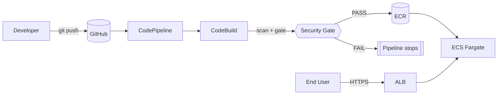

# Secure AWS CI/CD Pipeline with Automated DevSecOps Security Gates

A CI/CD pipeline for a small Node.js API where security scanning is an
**enforced, automated gate** — not a dashboard nobody reads. Five scanner
categories (SAST, dependency/SCA, secrets, IaC, container) run on every
build; a policy engine evaluates their output against configurable
thresholds; and the deployment simply does not happen if the gate fails.
There is no manual "approve to deploy" button standing between a scan
result and the decision it should drive.

**This is a real, currently-deployed system**, not a design exercise: the
full pipeline (GitHub → CodePipeline → CodeBuild → 5 security gates → ECR →
ECS Fargate → ALB) is live in a real AWS account, and a supplementary
public API demo runs on Vercel. See [Live demo](#live-demo) for both URLs,
and [Production debugging experience](#production-debugging-experience) /
[`docs/production-incidents.md`](docs/production-incidents.md) for a
factual log of eight real deployment failures this project's infrastructure
hit and how each was root-caused and fixed.

## Table of contents

- [Overview](#overview)
- [Problem statement](#problem-statement)
- [Objectives](#objectives)
- [Features](#features)
- [Architecture](#architecture)
- [Tech stack](#tech-stack)
- [Security controls](#security-controls)
- [CI/CD workflow](#cicd-workflow)
- [Security gate workflow](#security-gate-workflow)
- [AWS architecture](#aws-architecture)
- [Repository structure](#repository-structure)
- [Prerequisites](#prerequisites)
- [AWS setup](#aws-setup)
- [GitHub setup](#github-setup)
- [Terraform deployment](#terraform-deployment)
- [Pipeline configuration](#pipeline-configuration)
- [Local development](#local-development)
- [Testing](#testing)
- [Security testing](#security-testing)
- [Intentional-vulnerability demo](#intentional-vulnerability-demo)
- [Monitoring](#monitoring)
- [Troubleshooting](#troubleshooting)
- [Research component](#research-component)
- [Production debugging experience](#production-debugging-experience)
- [Limitations](#limitations)
- [Future improvements](#future-improvements)
- [Live demo](#live-demo)
- [Demo walkthrough](#demo-walkthrough)
- [Author](#author)

## Overview

This repository contains three things that work together:

1. **A small demo API** (`app/`) — Express, JWT auth, bcrypt, input
   validation, structured logging — that exists to give the pipeline
   something real to build, scan, and deploy.
2. **A security gate** (`security/`) — five scanner wrapper scripts plus a
   policy engine (`security-gate.sh`) that reads their normalized reports,
   evaluates them against `security/policy/security-policy.yaml`, and
   fails closed (blocks) on a threshold violation, a missing report, a
   malformed report, or a scanner crash.
3. **AWS infrastructure as code** (`terraform/`) and **pipeline
   definitions** (`ci/buildspec.yml`, `.github/workflows/`) that wire the
   gate into an actual CodePipeline/CodeBuild/ECR/ECS Fargate deployment,
   with no manual approval stage — the gate itself is the approval
   mechanism.

## Problem statement

Security scanning bolted onto a pipeline as an advisory step (generate a
report, maybe post it to Slack) does not change what ships — only
enforcement does. This project treats "the gate" as a piece of software
with a specification and a test suite, not as glue code that happens to
call some scanners. See [`docs/research-notes.md`](docs/research-notes.md)
for the full research framing.

## Objectives

- Make security scanning a **blocking** step, not an advisory one.
- Make the gate **fail closed**: a scanner that didn't run is treated the
  same as a scanner that found a critical vulnerability, not ignored.
- Keep the policy **configurable without touching code**
  (`security-policy.yaml`), so severity thresholds are a reviewable,
  versioned decision rather than a hardcoded one.
- Build real, working AWS infrastructure with **least-privilege IAM**,
  documented permission-by-permission.
- Make the whole thing **demonstrable**: a reproducible way to trip each
  scanner on purpose and watch the gate block the deployment, then revert
  and watch it pass.

## Features

- REST API: `GET /health`, `POST /api/auth/register`, `POST
  /api/auth/login`, `GET /api/users/profile` (JWT-protected).
- bcrypt password hashing, JWT auth middleware, Helmet security headers,
  express-rate-limit, express-validator input validation.
- Structured logging (pino) with automatic redaction of
  password/token/secret fields.
- Centralized error handling that never leaks stack traces to clients.
- Multi-stage, non-root, health-checked Docker image.
- Five independent security scanners, each with its own wrapper script and
  normalized JSON report format.
- A policy-driven, fail-closed gate engine with its own fixture-based test
  suite (7 scenarios, all passing).
- Modular Terraform (8 modules) for VPC, IAM, ECR, ECS Fargate + ALB,
  CodeBuild, CodePipeline, CloudWatch, and shared security primitives
  (KMS, Secrets Manager, SSM).
- A GitHub Actions workflow that mirrors the exact same scan-then-gate
  sequence CodeBuild runs, for PR-time enforcement.

## Architecture



Full diagrams (high-level system, CI/CD flow, security gate decision flow,
AWS infrastructure, threat/data-flow) are in
[`docs/architecture.md`](docs/architecture.md) and as standalone Mermaid
sources in [`diagrams/`](diagrams/).

## Tech stack

| Layer | Technology |
|---|---|
| Application | Node.js 22, Express, bcryptjs, jsonwebtoken, express-validator, helmet, express-rate-limit, pino |
| Container | Docker (multi-stage: `node:22-alpine` build stage, `gcr.io/distroless/nodejs22-debian12:nonroot` runtime — smallest measured CVE surface of the options actually scanned with Trivy, see `app/Dockerfile`) |
| SAST | Semgrep |
| Dependency/SCA | npm audit, OWASP Dependency-Check |
| Secret scanning | Gitleaks |
| IaC scanning | Checkov |
| Container scanning | Trivy |
| SBOM | Syft (CycloneDX + SPDX, best-effort) |
| IaC | Terraform (AWS provider ~> 5.0) |
| CI/CD | AWS CodePipeline, AWS CodeBuild, GitHub Actions (mirror) |
| Registry | Amazon ECR (scan-on-push, immutable tags) |
| Compute | Amazon ECS Fargate behind an Application Load Balancer |
| Secrets/config | AWS Secrets Manager, SSM Parameter Store |
| Observability | Amazon CloudWatch (Logs, Alarms), SNS |
| Testing | Jest, Supertest |

## Security controls

See [`docs/security-model.md`](docs/security-model.md) for the full
layer-by-layer breakdown. In brief: input validation, bcrypt hashing, JWT
with issuer/expiry, Helmet headers, rate limiting, redacted logging,
non-root/read-only-filesystem containers, immutable/scan-on-push ECR,
private-subnet-only compute, least-privilege IAM (one role per actor,
every permission commented), KMS encryption at rest everywhere applicable,
and the fail-closed automated security gate.

## CI/CD workflow

`Source (GitHub via CodeStar Connection) -> Build (CodeBuild) -> Deploy
(ECS)`. No manual approval stage. See
[`ci/buildspec.yml`](ci/buildspec.yml) for the exact commands CodeBuild
runs: install -> lint -> unit tests -> docker build -> all five scanners ->
`security-gate.sh` -> (only on PASS) ECR push with digest resolution ->
`imagedefinitions.json` for the Deploy stage.

## Security gate workflow

```
security/scripts/run-*.sh          -> security/reports/<category>/*.json (normalized)
security/policy/security-policy.yaml -> thresholds per category
security/scripts/security-gate.sh  -> reads reports + policy, prints
                                       SECURITY GATE RESULT table,
                                       exits 0 (PASS) or 1 (FAIL) or 3 (gate broken)
```

Fail-closed: a missing report, a malformed report, or a scanner that
crashed are all treated as violations, not skipped. See
[`docs/security-model.md`](docs/security-model.md) section 3 and
[`tests/security/run-tests.sh`](tests/security/run-tests.sh) (7/7 passing
fixture scenarios).

## AWS architecture

VPC with public subnets (ALB, NAT gateway) and private subnets (ECS
Fargate tasks, no public IP); ECR with scan-on-push and immutable tags;
CodeBuild in privileged mode for `docker build`; CloudWatch log groups and
alarms (ECS running-task-count, ALB 5xx rate, ALB p95 latency) with SNS
notification; a shared KMS CMK encrypting ECR, Secrets Manager, CloudWatch
Logs, and the pipeline's S3 artifact bucket. Full diagram in
[`docs/architecture.md`](docs/architecture.md#4-aws-infrastructure).

## Repository structure

```
app/                  Node.js/Express demo API + Dockerfile + Jest tests
security/
  policy/             security-policy.yaml — configurable thresholds
  scripts/            one wrapper script per scanner + security-gate.sh
  reports/            generated scan output (gitignored, .gitkeep only)
terraform/
  modules/            networking, iam, ecr, ecs, codebuild, codepipeline,
                       cloudwatch, security
  environments/dev/   concrete dev deployment wiring the root module
ci/
  buildspec.yml       the real CodeBuild pipeline definition
  scripts/            ecr-login.sh, push-image.sh, generate-sbom.sh
tests/
  security/           tests for the gate engine itself (fixture-based)
  integration/         end-to-end API test
docs/                 architecture, security model, deployment, threat
                       model, troubleshooting, research notes
diagrams/             standalone Mermaid sources
.github/workflows/    security-gate.yml, terraform-validate.yml
```

## Prerequisites

AWS account, AWS CLI v2, Terraform >= 1.5.0, Docker, Node.js >= 20, a
GitHub account. See [`docs/deployment.md`](docs/deployment.md) section 1.

## AWS setup

See [`docs/deployment.md`](docs/deployment.md) sections 2-3: create a
CodeStar Connection to GitHub (interactive, cannot be automated by
Terraform) and a Terraform state backend (S3 bucket + DynamoDB lock
table), both one-time, per AWS account.

## GitHub setup

Push this repo to your own GitHub account, complete the CodeStar
Connection's GitHub authorization, and (recommended) require the
`security-gate` GitHub Actions check before merging to `main`. Full steps
in [`docs/deployment.md`](docs/deployment.md) section 2.

## Terraform deployment

```bash
cd terraform/environments/dev
cp backend.tf.example backend.tf              # fill in your state bucket/table
cp terraform.tfvars.example terraform.tfvars  # fill in github_owner/repo, connection ARN
terraform init
terraform plan  -var-file=terraform.tfvars
terraform apply -var-file=terraform.tfvars
```

Full walkthrough, including what each `apply` provisions and cost notes
for a student AWS account, in
[`docs/deployment.md`](docs/deployment.md) sections 4-5.

## Pipeline configuration

The CodeBuild project (`terraform/modules/codebuild`) is preconfigured to
run [`ci/buildspec.yml`](ci/buildspec.yml) from the repo root. No
additional configuration is needed beyond the Terraform variables above —
the pipeline triggers automatically on pushes to `github_branch` (default
`main`).

## Local development

```bash
cd app
cp ../.env.example .env
npm install
npm run dev
curl http://localhost:3000/health
```

## Testing

```bash
make install
make test    # unit tests (app/tests) + integration tests (tests/integration)
make lint
```

Actually run in this repository: 14 unit tests + 3 integration tests, all
passing; ESLint clean.

## Security testing

```bash
make security        # runs every installed scanner, then the gate
make security-test   # tests the gate's own decision logic against fixtures
```

Exact install commands for each scanner in
[`docs/troubleshooting.md`](docs/troubleshooting.md).

## Intentional-vulnerability demo

A full, reproducible walkthrough — trip the dependency scanner, the secret
scanner, the SAST scanner, the IaC scanner, and the container scanner,
each in an isolated and clearly-marked way, watch the gate block the
build, then revert and watch it pass — is in
[`docs/deployment.md`](docs/deployment.md#10-intentional-vulnerability-demonstration).

## Monitoring

CloudWatch log groups for the app, CodeBuild, and CodePipeline; alarms on
ECS running-task-count, ALB 5xx error count, and ALB p95 latency,
notifying an SNS topic (subscribe your email via the
`alarm_notification_email` Terraform variable).

## Troubleshooting

See [`docs/troubleshooting.md`](docs/troubleshooting.md): scanner install
commands, gate exit-code meanings, Terraform provider download issues,
CodePipeline/ECS common failure modes, and JWT secret rotation.

## Research component

This project doubles as a research artifact on whether automated,
fail-closed enforcement changes deployment outcomes compared to advisory
scanning. [`docs/research-notes.md`](docs/research-notes.md) defines the
problem statement, three testable hypotheses (H1-H3), and exact metrics
(MTTD, MTTR, Deployment Block Rate, Vulnerability Detection Rate, False
Positive Rate, Scan Overhead, Pipeline Execution Time) and methodology —
without fabricating measured results that would require running that
methodology against real pipeline executions. It also states plainly
which piece of this has actually been measured so far (a qualitative
production-incident case study — see below) versus what remains a
proposed, not-yet-run quantitative trial.

**Further reading:**
- [`docs/research-notes.md`](docs/research-notes.md) — problem statement, hypotheses, methodology, metrics
- [`docs/research-paper-ieee.pdf`](docs/research-paper-ieee.pdf) — IEEE-style write-up of the above, plus the production incident case study
- [`docs/project-guide.pdf`](docs/project-guide.pdf) — comprehensive technical reference covering architecture, security gates, AWS infrastructure, deployment, and the full incident log
- [`docs/threat-model.md`](docs/threat-model.md) — STRIDE-style threat table and supply-chain security notes
- [`docs/deployment.md`](docs/deployment.md) — exact, reproducible deployment steps for both the AWS pipeline and the Vercel demo

## Production debugging experience

Deploying this project's Terraform to a real AWS account surfaced eight
genuine failures — region-specific assumptions, IAM permissions AWS's own
documentation omits, a stricter-than-expected buildspec YAML parser, and a
distroless-image health-check bug that took log-level evidence (not just
the error message) to root-cause correctly. Every one is documented with
the exact error text, the investigation that found the real cause, and the
fix, in [`docs/production-incidents.md`](docs/production-incidents.md).
This is not a curated highlight reel — it is the complete list of
deploy-blocking issues encountered getting from `terraform apply` to a
healthy, ALB-served ECS Fargate task.

## Limitations

- No DAST, fuzzing, or formal penetration testing.
- No CloudTrail/AWS Config deployed (documented as the largest gap versus
  a production-grade deployment — see `docs/threat-model.md` #11).
- No automatic Secrets Manager rotation (manual rotation steps documented
  in `docs/troubleshooting.md`).
- No image signing / SLSA provenance attestation (see
  `docs/threat-model.md`, Supply Chain section).
- Single NAT gateway (cost-optimized for a demo/student account, not
  multi-AZ-redundant).
- ALB serves plain HTTP (no ACM certificate/custom domain provisioned, to
  avoid the setup cost of a verified domain for a demo).
- SBOM generation (Syft) is best-effort and currently informational, not a
  gate input.
- In-memory user store (`app/src/models/userStore.js`) — no persistence
  across process/task restarts, and unreliable across Vercel serverless
  cold starts specifically (see [Live demo](#live-demo)). A real
  deployment would back it with RDS/DynamoDB.
- No AI/ML component — the project's engineering focus is deliberately
  the CI/CD pipeline and its security gates, not the application layer.
  A minimal interactive demo UI exists (`app/public/`, plain HTML/CSS/JS,
  no build step) but only as a way to exercise the API in a browser on
  the Vercel deployment — it is not served by the AWS/ECS deployment,
  which remains API-only, and it carries no security review of its own
  beyond what Helmet/CSP already provide server-side.

## Future improvements

- Wire SBOM diffing into the gate (block on a new, unreviewed component
  appearing).
- Image signing (cosign/Sigstore) and SLSA provenance attestations,
  verified before ECS deploy.
- CloudTrail + AWS Config for full account-level audit trail.
- Automatic Secrets Manager rotation via a Lambda rotation function.
- Multi-AZ NAT gateways and an HTTPS listener with ACM for a
  production-grade (not just demo-grade) deployment.
- Rootless/Kaniko-style container builds to remove CodeBuild's
  `privileged_mode` requirement.
- Actually execute the `docs/research-notes.md` methodology against real
  pipeline runs and report measured DBR/VDR/FPR/MTTD/MTTR figures.

## Live demo

Two separate, genuinely running deployments — do not confuse them:

| | AWS production pipeline | Vercel API demo |
|---|---|---|
| **What it is** | The actual system this README describes: GitHub → CodePipeline → CodeBuild → 5 security gates → ECR → ECS Fargate → ALB | A supplementary, publicly reachable copy of just the Express API, for quick poking without needing AWS access |
| **URL** | `http://secure-cicd-dev-alb-907205721.ap-south-1.elb.amazonaws.com` | `https://secure-aws-cicd-demo-api.vercel.app` |
| **Try it** | `curl http://secure-cicd-dev-alb-907205721.ap-south-1.elb.amazonaws.com/health` | Open `https://secure-aws-cicd-demo-api.vercel.app` in a browser for an interactive demo UI (register/login/profile), or `curl .../health` for raw JSON |
| **Runs the security gate?** | Yes — every deploy | No — Vercel's build does not run Semgrep/Trivy/Checkov/`security-gate.sh` |
| **Persistence** | ECS task, in-memory user store (resets on task restart) | Serverless function, in-memory user store (resets on every cold start — expect registered users to disappear between requests) |

The ALB target is a **student/demo AWS account kept running only while
this project is being actively evaluated** — plain HTTP (no ACM
certificate/custom domain provisioned, see [Limitations](#limitations)),
single NAT gateway, smallest Fargate task size. It is not a
cost-optimized-for-uptime production service and may be torn down
(`terraform destroy`) after evaluation to stop AWS billing; the Vercel
demo is the more durable of the two public endpoints. Both were verified
reachable from a clean, unauthenticated request as of the last update to
this README.

Full architecture diagrams (system, CI/CD sequence, security-gate decision
flow, AWS infrastructure) are in
[`docs/architecture.md`](docs/architecture.md).

## Demo walkthrough

1. `curl` the AWS ALB `/health` endpoint above — that response came from a
   real ECS Fargate task that only exists because a CodeBuild run passed
   all five security gates.
2. Push a clean commit to `main` — watch the pipeline go Source → Build
   (gate PASS) → Deploy in the CodePipeline console.
3. Run the [intentional-vulnerability demo](#intentional-vulnerability-demo)
   locally or push one of its scenarios to a branch — watch the gate FAIL
   and the Deploy stage never run.
4. Revert and push again — watch it PASS.
5. Read [`docs/production-incidents.md`](docs/production-incidents.md) for
   what actually broke (and how it was diagnosed) getting this pipeline to
   a genuinely healthy state the first time.

## Author

Raghav Anand — raghavanand033@gmail.com
