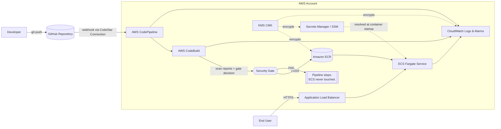
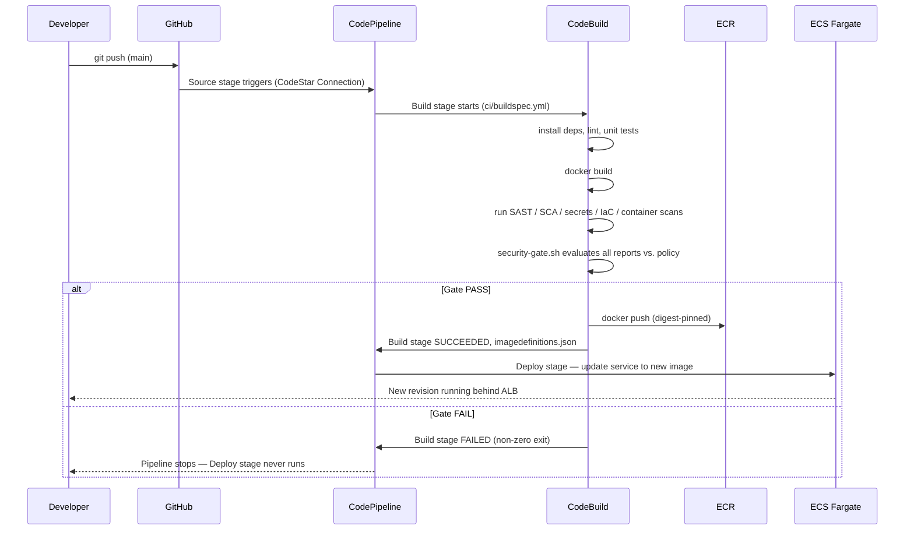
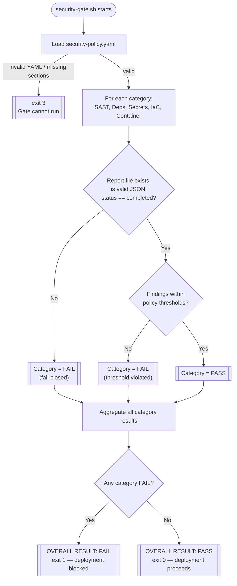
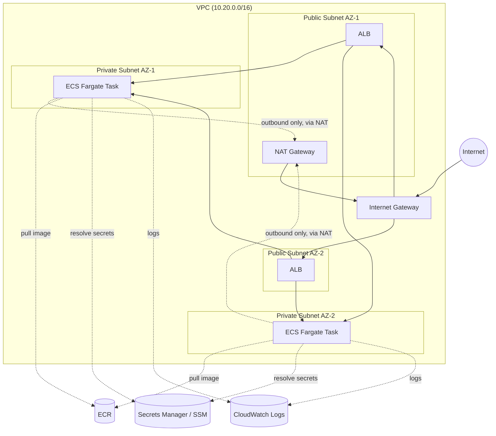
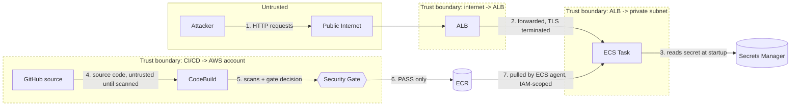

# Architecture

## 1. High-level system

Everything downstream of the Security Gate only runs if the gate passes.
There is no manual approval action in CodePipeline — the gate itself,
running as CodeBuild commands, is the enforcement point.

## 2. CI/CD pipeline flow

## 3. Security gate decision flow

## 4. AWS infrastructure

Key properties:
- ECS tasks run in **private subnets only**, with no public IP. The ALB in
  the public subnets is the sole ingress path.
- The ECS tasks' security group accepts inbound traffic **only** from the
  ALB's security group, on the container port.
- Outbound internet access from private subnets (image pulls that aren't
  cached, dependency downloads during build-time only, AWS API calls) goes
  through a NAT gateway — there is no direct route from a private subnet to
  the internet gateway.

## 5. Threat / data-flow diagram

Numbered flows map directly to the STRIDE analysis in
[`threat-model.md`](./threat-model.md): (1)/(2) cover ALB/app-layer threats
(rate limiting, input validation, injected headers), (3) covers secrets
handling, (4)-(6) cover supply-chain/pipeline-integrity threats (why the
gate exists at all), and (7) covers image-pull/registry integrity
(immutable tags, scan-on-push, least-privilege IAM).

## Component responsibilities

| Component | Responsibility |
|---|---|
| GitHub | Source of truth for application code, IaC, pipeline config |
| CodeStar Connection | Authenticated, tokenless link from CodePipeline to GitHub |
| CodePipeline | Orchestrates Source -> Build -> Deploy, no manual gates |
| CodeBuild | Runs `ci/buildspec.yml`: build, test, scan, gate, push |
| `security-gate.sh` | Policy engine — the actual pass/fail decision maker |
| ECR | Immutable, scan-on-push image registry |
| ECS Fargate | Runs the container, no server management |
| ALB | TLS termination point (in a real deployment) and load balancing |
| Secrets Manager / SSM | Runtime secret/config injection, never baked into the image |
| CloudWatch | Logs, metrics, alarms, SNS notifications |
| KMS | Encryption at rest for ECR, Secrets Manager, CloudWatch Logs, S3 |
